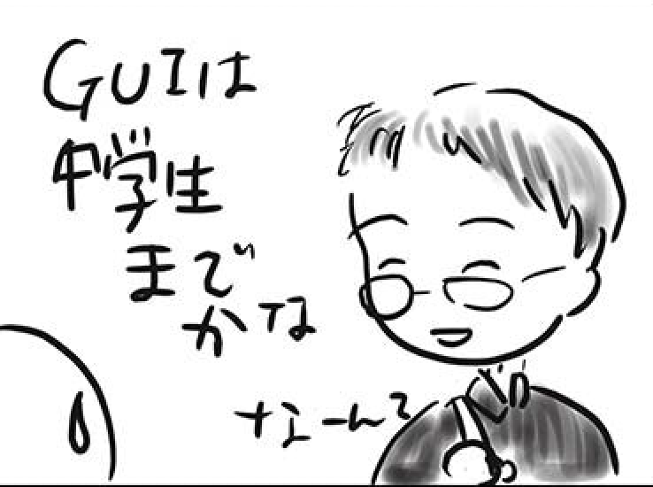

# 転職にも良く効く CLI専門支部

波田野 裕一 (tcsh)

CLI専門支部は、AWSの公式コマンドツールである"AWS CLI"でハンズオンを行う支部です。
2014年7月に立ち上がった、JAWS-UG 初の専門支部であり、ハンズオンの開催回数はAWSコミュニティ内では世界最多(非公式: 2025年10月現在)となっています。

CLI専門支部のConnpassページ: https://jawsug-cli.connpass.com/

## 10年経っても陳腐化しないAWS知識

AWS CLIは、AWSサービスの本体とも言えるAWS APIを直接操作することができるコマンドツールです。
デザインが割としょっちゅう変わるマネジメントコンソール(通称:マネコン)に対して、APIは、機能が追加されることはあっても、操作方法が変わることはほぼありません。
(自分のこの12年の記憶でも、比較的メジャーな破壊的変更は、Lambdaのリリース直後にロールの扱いが変わったのと、CloudFrontに必須パラメータが追加されたのくらいしかありません。)

つまり、一度AWS CLIで操作を覚えちゃうと、10年後もそのままその知識が使える、というとても美味しいメリットがあるのです。

更に、変更前と変更後に確認コマンドで、設定状態をAPIレベルで確認できるため、なにかのときに「戻し」をするのもさほど難しくはありません。
(マネコンの正確な「戻し」ってどうやってやるんですかね? 「だいたいこんな感じ」には戻せると思いますが...)

個人的には、本番環境での作成(Create)、変更(Update)、削除(Delete)は、CLIやSDKなどのAPIベースでやるべきであり、「本番環境でGUI(マネコン)を使ってもいいのは中学生まで」というフレーズをよく使っていたりします。
(今どきの高校生は、カード1枚あれば、がちでクラウド使えますからね...)

{#figure1}

## CLIでのAPI知識は転職によく効く (通称「JAWS-UG 転職支部」

マネコンは知識が曖昧でも、雰囲気でなんとなく操作できてしまいますが、CLIでAPIを操作するには、そんな生温いレベルでは歯が立たず、API仕様を正確に理解しておく必要があります。

これが、実に転職には効果的で、約12年の活動(450回以上の開催、のべ14000人以上の参加者)からは、100名以上のクラウド転職者が誕生しています。
CLI専門支部からのクラウド転職者は、あのブログの会社が一番多いのですが、目黒(2025年10月現在)のあのクラウドの会社の中の人として活躍されている方々もおられます。

おかげさまで、みなさんからは「AWS CLIで基礎が固まったのが大きかった」とおっしゃっていただけています。

## CLI専門支部の最近の活動

ここ数年は、全てのAWS APIサービスの基礎ともなる、IAMを中心に解説とハンズオンを行っており、「IAMの全リソース、全アクション、全パラメータを扱う」ハンズオンをシリーズでやっていたりします。

他ではなかなか聴けない、「公式なAPI仕様に忠実な技術解説」とともに、CLIハンズオンで実際にAPIをさわってみる。
そんな経験を積んでみませんか?

2026年度からは、他のサービスにも手を伸ばしていきたいと思いますので、ご期待ください。

#### 著者紹介

---

    
    

        

            <b>波田野 裕一 ( tcsh )</b>  
            X: <a href="https://x.com/tcsh">https://x.com/tcsh</a>  
            AWS Hero: <a href="https://builder.aws.com/community/@hatano">Builder Center</a> 
            AWS Samurai 2017: <a href="https://aws.amazon.com/jp/blogs/news/aws-samurai-2017/">blogs</a>  
            AWS Samurai 2020: <a href="https://note.com/s_numaguchi/n/nc9861bb097bd/">blogs</a>  
            所属支部: <a href="https://jawsug-cli.connpass.com/">JAWS-UG CLI専門支部</a> / <a href="https://jawsug-arch.connpass.com/">JAWS-UG アーキテクチャ専門支部</a> / <a href="https://jawsug-asa.connpass.com/">JAWS-UG 朝会</a>
        

    

JAWS-UGにはJAWS Days 2014が初参加(ぼっち)で、当時は会場に熱気に気押されて、懇親会にも参加せずにスゴスゴと帰りました。
皆、最初はそんな思いをしているものです。コミュニティでのおすすめアクションは「こんな失敗しちゃいました」系の発表です。

