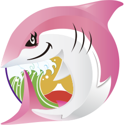

# JAWS-UG クラウド女子会とは？

 
JAWS-UGクラウド女子会は、AWSに関わる、もしくは学ぼうとしている、あらゆる女性をターゲットとした支部です。運営は全員女性で構成されています。
特定の技術領域や地域に特化せず、楽しく学べる事をベースとしてイベントを主催しています。  

JAWS-UG クラウド女子会のページ：https://jawsug-cloudgirl.connpass.com/

## クラウド女子会の参加者

クラウド女子会は、何事も楽しんで取り組める女性であれば、参加者の職種（エンジニア、デザイナー、マーケターなど）は問いません。
参加者のターゲットは女性ですが、エスコート制度により、参加女性1人につき男性1人参加が出来ます。過去には、同僚や友人の方、中にはご夫妻で子連れ参加される方などもいらっしゃいました。

## 開催場所、タイミング

基本的には東京を拠点に四半期に一回を目途に開催しています。
最近はJAWS-UGの他支部とのコラボ開催も積極的に行っており、名古屋支部（2025/8）コラボでは名古屋へ、情シス支部＆札幌支部（2025/5）コラボでは札幌で開催しています。
地方にいるけれどクラウド女子会に参加したい！という方がいらっしゃれば運営メンバが各支部とのコラボを相談し、現地に駆け付けます！
※コラボ開催については男女問わず参加者を募っています。

### 2023年リブート（再始動）後の他支部コラボの実績

- 2025/8：名古屋支部
- 2025/5：情シス支部、札幌支部
- 2025/4：Media-JAWS
- 2024/11：群馬支部
- 2024/7：福岡支部
- 2024/2：札幌支部
- 2023/8：佐賀支部、長崎支部
- 2023/3：東北支部

また、クラウド女子会は、ご家庭の事情や業務が多忙な方でも参加しやすいように、基本的には休日の午後の時間帯に開催しています。

## 2025年の活動

2025年は、これまでに以下のイベントを開催しています。LT（Lightning Talk）大会やAWS Builder Cards体験会、ハンズオンなど、開催内容は多岐に渡ります。

### 第27回クラウド女子会 ～re:Invent 振り返りLT会～

2024/12に開催されたre:Invent 2024（年に一度ラスベガスで開催されるAWSによる世界規模の学習型カンファレンス）の内容に関する振り返りLT大会を開催しました。

### Media-JAWS 【第19回】クラウド女子会コラボ！

Media-JAWSとコラボでの開催でした。AWSさんによるNAB Showのre:Capや、メディア業界に関わる女性の登壇、キャリアに関わる座談会など多岐に渡る内容で、非常に有意義な会でした。

### JAWS-UG 情シス支部 第31回 クラウド女子会×札幌支部コラボ会

情シス支部、札幌支部とのコラボ開催でした。各支部の関係者によるLT大会及び、CloudWatchに関するチョークトーク（参加者と講演者の対話型のセッション）を行いました。チョークトークでは活発な意見が出、大変盛り上がりました。

### 第28回クラウド女子会 ～夏のLT大会！＆AWS BuilderCards v2をプレイしよう～

AWSを学ぶことのできるカードゲームであるAWS BuilderCardsのVersion2を参加者みんなで楽しみました。

### クラウド女子会×JAWS-UG 名古屋 8月会①　コラボ会

名古屋支部とのコラボ会でした。クラウド女子会の運営が名古屋に向かい、名古屋支部メンバと共にLT大会とAmazon Q Developerのハンズオンを行いました。

### 第29回クラウド女子会 ～ちょっと長いLTしましょ〜

11/22（土）に開催予定の会で、re:Invent直前LT、キャリアに関するLT、オンプレミスに関するLT、技術ネタLTの枠を作り、登壇者を一般募集しています。
（執筆時点で未開催）

## クラウド女子会はこんな人におすすめ

以下のような方にお勧めです。

- JAWS-UGはじめ、技術関連のコミュニティは男性参加者が多く、女性一人では参加し辛い
- 女性ならではの悩みなどを相談したい
- AWSに関わる他社の女性と交流したい
- 非エンジニア職だが、JAWS-UGに興味がある

クラウド女子会は女性参加者をターゲットにしており、男性参加者もエスコート制度での参加に絞っているため、心理的安全性が高く、参加のハードルが低い支部になっています。
また、毎回15～20分程度、運営 + 参加者数名で、お互いの相談事項や今後クラウド女子会で取り扱ってほしいテーマなどについてディスカッションする場を設けていますので、女性ならではの悩みの相談をしたり、交流を図ったり、運営に対して要望を伝えたりがしやすくなっています。

クラウド女子会でJAWS-UGに慣れ、他支部のイベントに参加される方も多く、女性がJAWS-UGに参加する入り口の支部としてもおすすめの支部です。

## おわりに

クラウド女子会の紹介文を読んで下さりありがとうございます。
上述の通り参加ハードルも高くなく（コラボ開催を除き基本女性限定ではありますが．．．）、また、技術や地域に特化せず様々な取り組みを行っている支部ですので、是非お気軽にご参加いただければと思います。
ご参加をお待ちしております！！

---
#### 著者紹介

---

    
    

        

            <b>五味なぎさ(@nagisa_53)</b>  
            X: <a href="https://x.com/nagisa_53">https://x.com/nagisa_53</a>  
            所属支部: <a href="https://jawsug-cloudgirl.connpass.com/">JAWS-UG クラウド女子会</a> / <a href="https://jawsug-sainokuni-saitama.connpass.com/">彩の国埼玉支部</a>  
            APN所属SIer勤務のクラウドアーキテクト兼マネージャー。元々ネットワーク系のSEだったため、AWSのネットワーク系サービスが大好物。AWS Ambassadors、AWS Community Buildersとして活動するなど、公私ともにAWSと深く関わる日々を送っています。
        

    

#### 著者以外の現在のコア運営メンバ

---

    

        

            <b>小寺 加奈子(@KanakoKode16)</b>
            &ensp;X: <a href="https://x.com/KanakoKode16">https://x.com/KanakoKode16</a>  
            <b>長濱 志歩</b>  
            <b>妹尾 歩美(@senooayumi)</b>
            &ensp;X: <a href="https://x.com/senooayumi">https://x.com/senooayumi</a>  
            <b>砂岡雪(白"雪姫”)</b>
            &ensp;X: <a href="https://x.com/yuri_snowwhite">https://x.com/yuri_snowwhite</a>  
        

    

