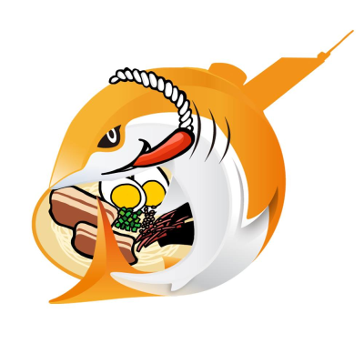
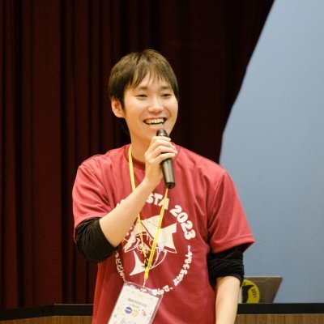
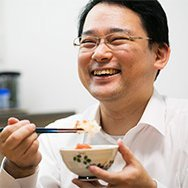
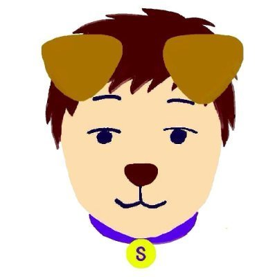
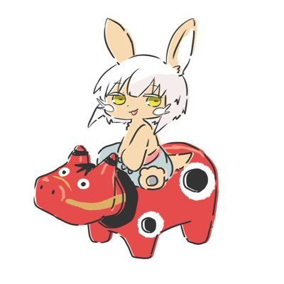
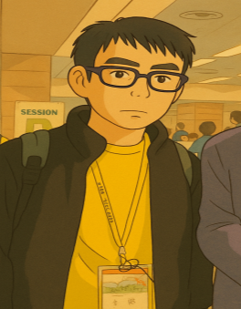

# 福岡支部について

木村健一郎（Kenichiro Kimura）

JAWS-UG福岡は、AWS User Group - Japan(JAWS-UG)の地方支部の1つで、福岡県を中心に活動しています。

## 支部の特徴

『博多名物「乾杯」から始まるJAWS-UG』をキャッチフレーズに、オンオフを問わず楽しくAWSについて学び、交流しています。初心者もベテランもお酒飲む人も飲まない人も誰でもお気軽にご参加いただけます。

オフラインイベントではキャッチフレーズの通り「乾杯」から始まり、和やかな雰囲気でAWSの最新情報や技術について学べる場を提供しています。また、オンラインもくもく会では、参加者が各自の課題に集中しながらも、質問や情報交換ができる環境を整えています。

### in北九州について

JAWS-UG福岡のサブグループとして、2025年より北九州市を拠点に活動をスタートしました。AWSに関心のある皆さんと一緒に、LT会やハンズオンを通じて交流と学びの場をつくっています。

## 主な活動内容

JAWS-UG福岡では、以下のような活動を行っています。

- オフラインイベント(2～3ヶ月に1回程度)
- オンラインもくもく会(毎週木曜 21時〜22時)

九州地域の他の支部とも密接に連携しており、互いのイベントの運営を相互に手伝いに行ったり、AWS SummitやJAWS DAYSなどの大規模イベントに向けて毎週リレー開催を行う「JAWS-UG九州キャラバン」などの取り組みを行ったりしています。

## 過去のイベント例

- [JAWS-UG福岡 #19: 15度目はちょっと濃いめに AWS BuilderCards で遊ぼう](https://jawsug-fukuoka.connpass.com/event/331182/)  
  AWS BuilderCards を通してAWS のサービスやアーキテクチャを楽しく学ぶイベント。
- [JAWS-UG福岡 #19: re:Invent re:Cap!!](https://jawsug-fukuoka.connpass.com/event/341319/)  
  AWS re:Invent 2024の内容を振り返るイベント。「JAWS-UG九州キャラバン 〜road to JAWS DAYS 2025〜」の一環として開催。
- [JAWS-UG福岡 #20: Storage-JAWS共催スペシャル](https://jawsug-fukuoka.connpass.com/event/338907/)  
  [Storage-JAWS](https://storage-jaws.connpass.com/)とのコラボイベント。
- [[現地開催] JAWS-UG福岡in北九州 #21 Amazon Q Developer ハンズオン](https://jawsug-fukuoka.connpass.com/event/346669/)  
  Amazon Q Developer for CLI を使ってAIエージェントを動かしてみるハンズオンイベント。「JAWS-UG九州キャラバン 〜road to Summit 2025〜」の一環として開催。
- [[現地開催] JAWS-UG福岡in北九州 #22 Amplifyを触ってみるよ。](https://jawsug-fukuoka.connpass.com/event/363283/)
  ハンズオンAWS Amplify Gen2 を使ったウェブアプリケーション構築の学び方
  
## 参加方法

JAWS-UG福岡のイベント情報は、主にConnpassで告知しています。興味のある方はぜひ以下のリンクから参加登録をお願いします。

https://jawsug-fukuoka.connpass.com/

#### コアメンバー紹介

---

    
    

        

            <b>青柳 英明</b>
                        <a href="https://x.com/hideaki_aoyagi">@hideaki_aoyagi</a>
        

    

    
    

        

            <b>あべたく</b>
                        <a href="https://x.com/east_takumi">@east_takumi</a>
        

    

    
    

        

            <b>内村 和博</b>
                        <a href="https://x.com/kazu_UCHIMURA">@kazu_UCHIMURA</a>
        

    

    
    

        

            <b>木村健一郎</b>
                        <a href="https://x.com/show_m001">@show_m001</a>
        

    

    
    

        

            <b>清家 史郎</b>
                        <a href="https://x.com/seike460">@seike460</a>
        

    

    
    

        

            <b>夏目 祐樹</b>
                        <a href="https://x.com/sinofseven">@sinofseven</a>
        

    

    
    

        

            <b>べこみん</b>
                        <a href="https://x.com/beco_minn">@beco_minn</a>
        

    

    
    

        

            <b>松岡 文雄</b>
                        <a href="https://x.com/tama_katsura">@tama_katsura</a>
        

    

    
    

        

            <b>森田 邦裕</b>
                        <a href="https://x.com/92hi_6">@92hi_6</a>
        

    

