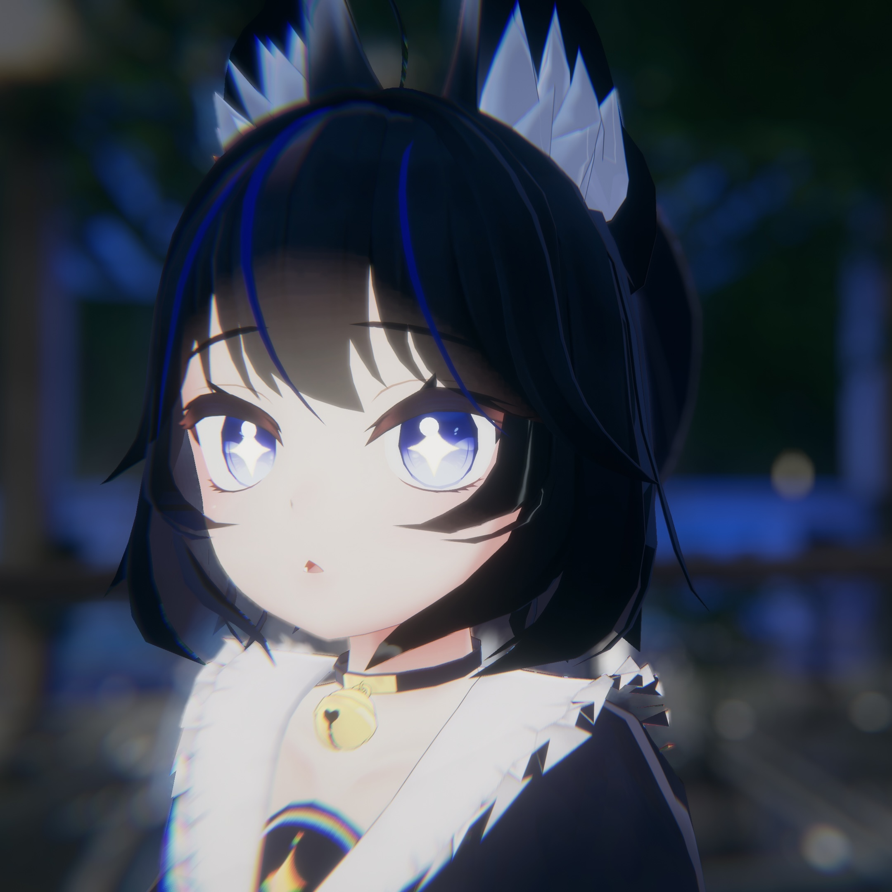

# JAWSは怖くないよ！初心者支部のすすめ

<div class="flush-right">
矢羽田春奈(祈織)<br> 
</div>

皆さんこんにちは。初めましての方は初めまして。 <br> 
矢羽田春奈と申します。SNSでは「祈織（いのり）」と名乗っています。<br>
今ではAWS界隈を中心に様々なコミュニティに参加していますが、コミュニティ参加を始めたのは25年8月で、初心者支部が初めてでした。 <br> 
今回はJAWS-UG初心者支部について、実体験も踏まえて紹介していきたいと思います。

## 初心者支部とは？
AWSを学び始めた方や活用していきたい方をターゲットとした支部で、AWSへの理解を深められるだけでなく、初心者支部を卒業して他の支部へ巣立つためのお手伝いもしてくださる支部です。  
初心者支部単独でのイベントもあれば、他の支部とのコラボ回もあります。  
内容はLTだけでなく、ハンズオン会や彩の国埼玉支部とのコラボ回ではAWS BuilderCars体験会も実施されていました。  
初心者支部にはつよつよエンジニアの参加者もいらっしゃるので、AWS初心者でなくても楽しめる支部です。

## JAWS-UGとの出会い
私が初めてJAWS-UGの勉強会に参加したのは、25年8月とかなり新参者です。  
実はそれより前からJAWS-UGの存在は知っていましたが、まだ全然知識がなかったので参加する勇気がありませんでした。
それが25年8月、Qiitaで調べ物をしていたら、おすすめ記事に初心者支部運営のTsukasaさんが書かれた「AWS完全初心者がAWS初心者になった話」という記事を見つけ、「JAWS-UGに参加した」と書かれていました。  
その瞬間、「JAWS-UGって初心者でも参加していいんだ！」と感じ、勢いで初心者支部勉強会の参加申込をしました。  
これが自分にとって大きな一歩であり、運命を変えるきっかけとなりました。

記事はこちら
‎```‎
https://qiita.com/tks_1128/items/cd9475917e83ccdf8828
‎```‎

## 勉強会の参加を重ねて
初めてJAWSの勉強会に参加した際、ただ聞いてメモするだけでなく、Twitter上でタグ付けして呟き、アウトプットする文化に驚きました。  
当時、技術系のTwitterアカウントを作ったばかりでしたが、初心者なりにたくさん呟いてアウトプットしていきました。  
最初は誰も知り合いがいませんでしたが、この初参加がきっかけでSNSで繋がりができる嬉しさを知り、モチベーションの高い人が多く、JAWS楽しい！と思える経験になりました。  
今では勤務地から会場が遠くても、初心者支部を中心に勉強会に毎月参加するようになりました。

## 人生初登壇を迎えて
何度か勉強会に参加していくうちに、登壇に挑戦してみたいという気持ちが芽生えました。  
しかし、私はCLF程度の知識しかなく、知識が浅い人間がLTしていいのか、人前で話すのは苦手…と、挑戦したい気持ちと不安な気持ちが入り混じっていました。  
やってみたい気持ちに気づいてくださったのか、「登壇してみませんか？」と何度か声をかけていただきました。  
最初にお声掛けいただいた時は、資格試験を直前に控えていたためお断りしましたが、試験が終わったら年内に必ず登壇することを目標にしました。  そして25年11月、大好きなJAWS-UG初心者支部で人生初登壇を果たしました。  
当日はとても緊張しましたが、見届けてくれる知り合いが何人かいたことや、勉強会の最初に拍手の練習をしてくださったこともあり、反省点はありつつも、良い登壇経験を迎えられたと思っています。

## おわりに　JAWSは怖くない！
私は、参加経験のある方のブログを読むことで背中を押してもらったおかげで、JAWSに参加しようと行動できました。  
今度は私が、知らないところで誰かの背中を押せたら嬉しい限りです。  
AWSの知識が少なくても、AWSに興味があれば楽しめる場所だと思っています。  
私の紹介文を読んでくださっている方で、JAWSに興味がある方は、ぜひ初心者支部に参加してみてください！きっと温かく迎えてくれるはずです。


#### 著者紹介

---

<div class="author-profile">
    
    <div>
        <div>
            <b>祈織 (矢羽田春奈)</b></br> 
            X：<a href="https://x.com/inorinori_">https://x.com/inorinori_</a></br> 
            Zenn：<a href="https://zenn.dev/inorinnori_62">https://zenn.dev/inorinnori_62</a></br>
        </div>
    </div>
</div>
<p style="margin-top: 0.5em; margin-bottom: 2em;">
今年8月からJAWSを中心にコミュニティ活動をしているインフラエンジニアもどき。<br>
好きなものは料理とプロ野球観戦、ご飯屋さん開拓、世界地理、文房具など。<br>
</p>