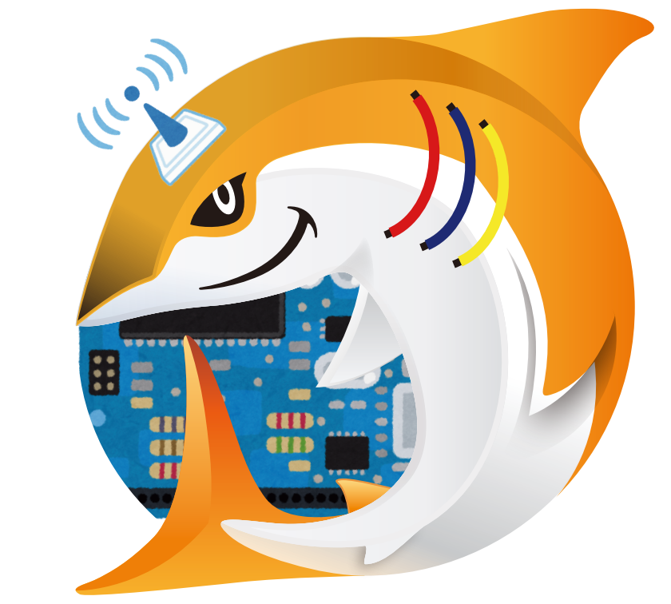

# IoT専門支部

立石　彰

## IoT専門支部って？

IoT専門支部は、その名の通りIoT関連の話題を専門に扱うJAWS-UGの支部です。では「IoT」って何でしょうか？

IoTの歴史はとても古く、その基盤の一つであるセンシング技術は電子回路の登場と共に生まれ、発展してきました。またIoTの要とも言えるインターネットにおいても、早い時期から「モノ」との接続が強く意識されていました。有名な「トロイの部屋のコーヒーポット」[^1]は1993年にインターネットに接続されており、1998年4月にはコーヒーポットとの通信を定義するプロトコル "HTCPCP" (Hyper Text Coffee Pot Control Protocol) の実装が提案[^2]されているほどです。 

IoT専門支部はその流れを汲み、センシングから通信、クラウドやデータ可視化など、IoTに関係する幅広い技術分野を取り扱う異色の専門支部です。JAWS-UGの一部として活動していることから、少なくとも話題の一部にはAWSが関係していることを意識して話題の選定を行っています。そこが他のIoT関係コミュニティとは異なる点でしょうか。

## IoT専門支部の歴史

AWS IoTは10年前、2015年10月8日に誕生しました。IoT専門支部では10周年を記念して2025年10月8日にこれまでの歩みを振り返るイベントを開催[^3]しています。イベントの模様は[アーカイブ](https://www.youtube.com/live/JWNOo3Sqd_4)が公開されていますので、是非ご覧ください。

実はIoT専門支部の歴史はAWS IoTの誕生よりも前のことで、記念すべき最初のイベント「もくもくIoTカフェ」は2015年6月23日[^4]に開催されました。これはAWS IoT誕生の3ヶ月以上前のことで、AWS IoTを支える技術の多くが普及する前のことでした。通信環境や開発環境も、今から思えば驚くほど貧弱なもので、そんな中でもIoTの普及を図ろうとする当時のJAWSメンバーの強い想いに支えられた門出となりました。

イベントで用いられたのはintelがIoTデバイスとして鳴り物入りでリリースした 「Edison」[^5]でしたが、巨人intelであってもこの市場の攻略は困難でした。先発のArduino[^6]やRaspberry Pi[^7]に対抗することはできず、2017年に製造終了となってしまいました。

## IoT専門支部の今後

IoT専門支部も、同様に時代の波に押されて幾度かの低空飛行を経つつ、現在に至りました。

Edisonの撤退に象徴されるハードウェアの急速な進化に加え、AWS IoTにおいてもサービスの改称や再編、技術の進歩に対応するためのアップデート、逆に必要性が低下したサービスの廃止などが行われてきました。IoTにとっての血液とも言える通信環境についても日々進化が続いています。

産業全体を見ると、「IoT」という考え方や概念は広く理解されるようになり、結果として「IoT」そのものが注目を浴びることは少なくなってきました。言い換えると、世の中のほとんど全てが **IoTを前提として** 構築される世の中になってきています。つまり、分野を問わない全ての技術者がIoTを理解しなければならない、IoTを理解してから全てが始まる、という世の中が到来しようとしています。

とても重要だが、目立たず、変化が早い。それが現在の「IoT」技術です。IoT専門支部では、このような外部環境の変化に対応しつつ、また生成AIのような新しい技術も視野に入れながら、初心者には気軽に楽しめる入り口を、初級者にはレベルアップを目指すきっかけを、そして中級者・上級者には更なる高みを目指すお手伝いを続けていきます。

[^1]: https://ja.wikipedia.org/wiki/%E3%83%88%E3%83%AD%E3%82%A4%E3%81%AE%E9%83%A8%E5%B1%8B%E3%81%AE%E3%82%B3%E3%83%BC%E3%83%92%E3%83%BC%E3%83%9D%E3%83%83%E3%83%88
[^2]: https://www.rfc-editor.org/rfc/rfc2324
[^3]: https://jawsug-iot.connpass.com/event/367418/
[^4]: https://jawsug-iot.connpass.com/event/16452/
[^5]: https://www.intel.co.jp/content/www/jp/ja/products/sku/84572/intel-edison-compute-module-iot/specifications.html
[^6]: https://blog.arduino.cc/2021/12/09/one-board-to-rule-them-all-history-of-the-arduino-uno/
[^7]: https://www.raspberrypi.org/about/

## さいごに

IoT専門支部では、地方支部や他の技術専門支部とのコラボレーションを強化する活動を開始しました。IoT専門支部と一緒にイベントを企画・開催してくださる支部や個人の方、ぜひお声掛けください。またイベントについては用意でき次第connpassに掲載、参加者募集が行われます。多くはオンライン・オフラインのハイブリッド開催となっておりますので、ご都合のよろしい方法で奮ってご参加ください。

ご興味のある方はぜひ[Facebookのグループ JAWS-UG専門支部](https://www.facebook.com/groups/jawsug.iot)や[connpassイベントページ](https://jawsug-iot.connpass.com/)にご参加、ご登録ください！

#### 著者紹介

---

    
    

        

            <b>立石　彰 ( TATEISHI, Akira )</b>  
            X：<a href="https://x.com/greennote_akira">https://x.com/greennote_akira</a>  
            Qiita：<a href="https://qiita.com/akira-greennote">https://qiita.com/akira-greennote</a>  
            Facebook：<a href="https://www.facebook.com/akira.ignote">https://www.facebook.com/akira.ignote</a>  
            AWS Builder Center: <a href="https://builder.aws.com/community/@akiratat">https://builder.aws.com/community/@akiratat</a> 
            所属：<a href="https://jawsug-iot.connpass.com/">JAWS-UG IoT専門支部</a>
        

    

2020~ AWS Community Builder (Serverless) 
今力を入れてること：本業（零細企業の何でも屋 兼 経営者なので……😢）   
すきなもの：AWS IoT / CDK / CLI / オリックス・バファローズ 

