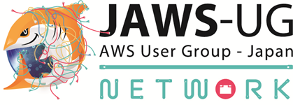

# NW-JAWSのススメ

 Shota Shiratori(@whitebird_sp)

NW-JAWSの紹介をさせていただきます。  
https://jawsug-nw.connpass.com/

## NW-JAWSとは
  

AWS利用がエンタープライズ企業へ広がっていくころ、オンプレミスとクラウドの接続に悩むエンジニアさんや通信キャリア、データセンターの事業者さん、ネットワーク機器メーカーなどの方を交え、2016年に第1回の勉強会を行いました。当時はNTTとKDDIという2大キャリアの社員が運営にかかわっていたことで大きな話題を呼びました。その後、ラスベガスでの現地開催、コロナ禍でのオンライン開催へのシフトを行っていく中でAWSネイティブな方が増え、AWSのことはよく知っていても逆にネットワークのことを知りたいという方が増えてきました。2023年からシーズン2として初心者向けにシフトし、3か月に一度程度の頻度でオンラインの勉強会を中心に開催しております。

### こんな方々を対象にしております
* AWSに取り組む中で、ネットワークに悩みを抱えているエンジニアさん
* AWSと接続しているデータセンターさん
* 通信キャリア・ネットワーク機器ベンダーさん

### 勉強会のフォーマット
NW-JAWSの勉強会は下記の形式で進めています！
* 昼開催オンライン：初心者向けコンテンツ（Lv.100-200相当）
* 夜開催オンライン：中級～上級者向けコンテンツ（Lv.300-500相当）
* オフライン：交流やハンズオン、チョークトークがメイン

## 初心者向けにおすすめポイント
**昼開催オンライン回が特におすすめ**です！ 
昼開催のオンライン回は、運営メンバーを中心にサービスカットでの初級解説（Amazon VPCとは？）だけではなく、「ネットワークはなぜつながるか？」というようなネットワークの基礎から解説していくため、AWSの初心者だけではなくて、ネットワークの初心者にもやさしいコンテンツになっています。 
また、登壇枠に若手枠を設けておりますので、社会人歴の浅い方や初めての登壇でも登壇のしやすい設計となっておりますので、お気軽に応募していただければと思います。

## NW-JAWSの特有のワード紹介
NW-JAWSを象徴する特有のワードを一つご紹介させていただきます。

### 体育座り
オンラインの勉強会でも時折『体育座り』というワードが出てきます。この語源は過去にラスベガスで開催されたNW-JAWSにおいて、なんと部屋のキャパシティを大幅に超える申し込みがあり、椅子が足りないどころか部屋中に体育座りでもギリギリ…という開催となった回がありました。当時私は運営メンバーではありませんでしたが、最前列で体育座りでセッションを聞き、3時間弱座り通しの勉強会だったことを今でも覚えています。

## さいごに
NW-JAWSは専門支部ながら、AWS×ネットワークの初心者だけではなく企業や自治体の情シスさんをはじめ非常に多彩な方の参加で成り立っています。専門支部らしく上級回もありますが、まずは**昼開催オンライン回**にご参加いただき、ネットワークの基礎と登壇経験を身に着けてグローバルに羽ばたいていっていただければと思います！

#### NW-JAWS運営メンバー

---

    
    

        

            <b>白鳥 翔太 @whitebird_sp（NTT東日本：AWS Ambassador/ネクストモード）</b> 
        

    

2009年入社。 
2018年よりクラウドサービス開発業務に携わる。 
2023年よりNTTグループに新設されたスペシャリストグレードの社員一期生となる。 
2025年11月からネクストモード株式会社へ出向 
2024-2025 AWS Ambassadors/2020-2025 Japan AWS Top Engineers/2023-2025 Japan AWS All Certifications Engineers  
好きな言葉は「Knowledge is power.」「Insist on the highest standards.」「Any sufficiently advanced technology is indistinguishable from magic.」

    
    

        

            <b>矢儀 丈博 @yuki_ink（TIS株式会社）</b> 
        

    

TIS株式会社に2020年に新卒入社。金融業界のお客様のインフラを担当しています。2023 AWS Jr. Champions / 2024-2025 Japan AWS Top Engineers (Services) / 2024-2025 Japan AWS All Certifications Engineers

    
    

        

            <b>Hibiki @gravitas122</b> 
        

    

SIerに2023年新卒入社。マルチアカウント、NW、IaCが好きです。2025 Japan AWS Jr. Champions/ 2025 Japan All AWS Certifications Engineers

    
    

        

            <b>Takumi Sato</b> 
        

    

通信企業に21年度入社。入社当初は公共系のお客様のインフラ担当。現在はAWS環境の運用保守を実施している。また新入社員200名に対してクラウド研修の講師なども担当。好きなサービス：AWS SecurityHub

