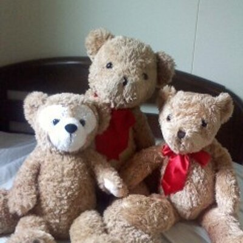
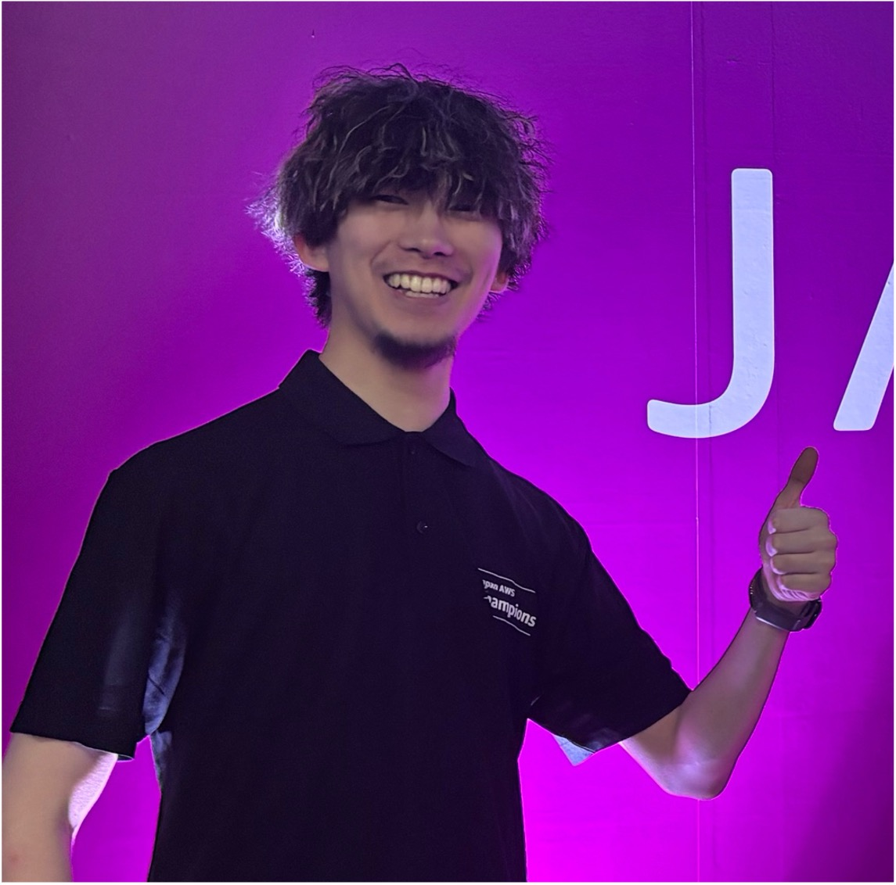
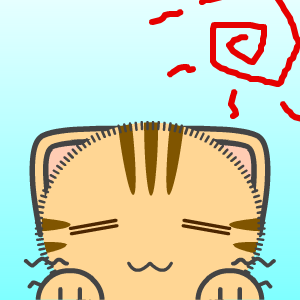

# JAWS-UG 新潟支部の紹介

JAWS‑UG 新潟支部は、AWSを学びたい人、使ってみたい人、地域でつながりたい人が集まるコミュニティです。新潟を拠点に、「初心者も経験者も気軽に参加できる」雰囲気を大切に活動しており、定期的に「プチキャッチアップ」やハンズオン、勉強会などを オンライン／オフラインの両面 で開催しています。

## 活動内容
### プチキャッチアップ
毎週木曜日21:00〜オンラインで行っているプチキャッチアップでは、当日始まってからやることを決めています。

AWSに関する記事やアップデートの共有を参加者同士で話しながら、理解を深めることができます。

学習にあまり時間がかけられない方や、最新の動向をキャッチアップしたい方なんかにおすすめです。

### オフラインの勉強会
新潟支部ではオフラインのイベントも定期的に開催しています。  
AWSのコンテナサービスや生成AIサービスのハンズオン、re:Inventの振り返りなど、さまざまなイベントを行なっています。

## なぜ新潟支部？
新潟支部はオンライン/オフラインのハイブリッドな運営により、物理的に遠くても参加しやすい支部です。  
新潟は東京のようにAWSイベントが頻繁に行われるわけではありませんが、
だからこそ一人ひとりのつながりが強く、アットホームな雰囲気が特徴です。 

初心者もベテランも関係なく、「話してみる」「聞いてみる」「一緒にやってみる」ことを楽しめるのが魅力です。

## さいごに
新潟支部は、  
「AWSを通じて学び、共有し、地域を盛り上げる」ことを目指しています。

勉強会に参加するだけでもOK、LTで発表してみるのもOK、
運営として企画に関わるのも大歓迎です。  

まずは気軽に、次のイベントから参加してみませんか？

#### 新潟支部運営メンバー

---

    
    

        

            <b>Hiroshi Kasahara</b>  
            X：<a href="https://x.com/kasacchiful">
https://x.com/kasacchiful</a> 
            github：<a href="https://github.com/kasacchiful">
https://github.com/kasacchiful</a> 
        

    

新潟でWeb、業務アプリ、インフラ等とりあえずなんでもやるエンジニア。

    
    

        

            <b>やくも</b>  
            X：<a href="https://x.com/yakumo_0905">
https://x.com/yakumo_0905</a> 
            github：<a href="https://github.com/shinnosukeyakumo">
https://github.com/shinnosukeyakumo</a> 
            Qiita：<a href="https://qiita.com/yakumo_09">
https://qiita.com/yakumo_09</a> 
        

    

Jr .Championの先輩の背中を追いかけていたら自分もAWS沼にどっぷりハマってしまいました。 
2025 Japan AWS Jr.Champion

    
    

        

            <b>カフェイン未摂取</b>  
            X：<a href="https://x.com/kam1nchu">
https://x.com/kam1nchu</a> 
            github：<a href="https://github.com/kaminchu">
https://github.com/kaminchu</a> 
        

    

    
    

        

            <b>sakapun</b> X：<a href="https://x.com/sakapun">
https://x.com/sakapun</a> 
        

    

新潟でシステム開発。得意領域はwebアプリ。日本スピッツ飼っています。ポーカー、麻雀、アコギ（フィンガースタイル）あたりが2025年時点での趣味活動。お酒全般飲みます最近はウイスキーでグレンリベットが好きな基準に色々試し中

