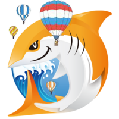

# 佐賀支部の紹介

柴尾　哲也 (Tetsuya Shibao)

JAWS-UG佐賀は、AWS User Group - Japan(JAWS-UG)の地方支部の1つで、佐賀県を中心に活動しています。

## 参加方法

参加頂く際は、こちらのConnpassからご参加ください。
https://jawsug-saga.connpass.com/

## 佐賀支部の歴史
佐賀支部は開始の歴史こそは古いのですが、現在は3回目の再始動（re:Boot）を経て現在の形があります。

| 年月 | イベント |
|------|----------|
| 2011年 | JAWS-UG佐賀活動開始 |
| 2014年11月 | JAWS-UG佐賀 re:Boot#1 |
| 2017年10月 | JAWS-UG佐賀 re:Boot#2 |
| 2023年2月 | JAWS-UG佐賀 re:Boot#3 |

## 佐賀支部の特徴

過去の再始動となった経緯から現在は"ゆるふわ"をモットーに活動しています。

佐賀は地形的に移動が難しいところもあるので地方支部ながらハイブリッドの取り組みを行ったり、
オフラインでは、施設の特性（バリアフリー、キッズスペース等）を考慮して開催しています。

内容としては、オフラインでのハンズオンやLTを中心に行っていますが、
地方は参加者が都市圏に比べると多くないので参加者同士の悩み相談を全員で解決するといった、
オフラインでもゆったりとしたペースで実施しています。

九州のJAWS-UG支部との連携もそうですが、
佐賀県内では、佐賀県からITコミュニティ支援業務を委託されている団体や、
佐賀県下の他のITコミュニティとも相互に連携しています。

開催するときは、JAWS-UGの他支部とのコラボ会のときもありますが、
佐賀で単独開催するときは、地元の祭りやバルーンフェスタなどの人が賑わう時期や、
2025年に11周年を迎えた某ゲームとのコラボ企画、2025年に映画が公開された某アニメがあり、
そういった企画と連動させることで、「ただ佐賀に来る」ということではなく、
「その企画のついでにJAWS-UG佐賀に参加する」という形で開催しています。

## 過去に開催したイベントについて

イベント開催のたびにposfie（旧Togetter）、開催ブログをまとめています。

https://sites.google.com/view/jawsug-saga/event

#### 佐賀支部運営メンバー

---

    
    

        

            <a href="https://x.com/sugimisu">@sugimisu</a>
        

    

    
    

        

            <a href="https://x.com/tobetchi">@tobetchi</a>
        

    

    
    

        

            <a href="https://x.com/DDDBTDA">@DDDBTDA</a>
        

    

    
    

        

            <a href="https://x.com/midnight480">@midnight480</a>
        

    

    
    

        

            <a href="https://x.com/UniKawazoe">@UniKawazoe</a>
        

    

    
    

        

            <a href="https://x.com/POcean10">@POcean10</a>
        

    

    
    

        

            <a href="https://x.com/uzak11">@uzak11</a>
        

    

