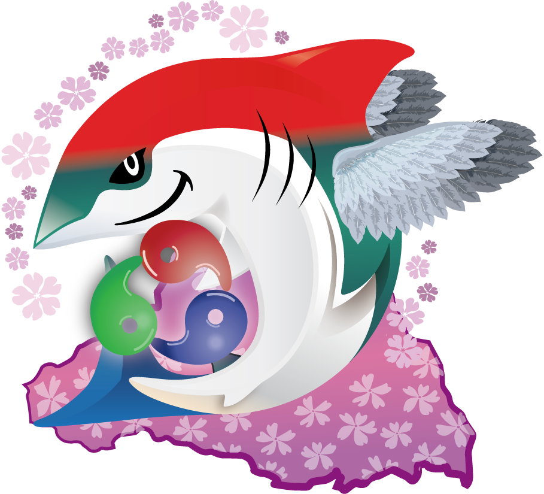

# JAWS-UG 彩の国埼玉支部とは？

アマレロ

JAWS-UG 彩の国埼玉支部は、彩の国・埼玉県を中心とした首都圏エリアの支部として、2025年4月7日に新たに設立しました。
2025年11月現在、運営メンバー11人で楽しく活動しています。
ここでは、彩の国埼玉支部についての紹介をさせていただきます。

JAWS-UG 彩の国埼玉支部 Connpassページ：https://jawsug-sainokuni-saitama.connpass.com/event/373005/

## 彩の国埼玉支部の支部コンセプト

彩の国・埼玉県を中心とした首都圏エリアの支部として、AWSに関する勉強会を通じて**楽しく自ら学び発信しあう活動**を担います。
また、**各地方支部や専門支部とのコラボ**や、**埼玉の地域創成**を重視し、街や文化の紹介と体験イベントなどもあわせて、
AWS初心者から習熟者まで、**誰もが楽しく**参加できる支部活動をめざします。

これまで、支部独自の勉強会だけでなく、他支部とのコラボ企画、勉強会と同日に埼玉県内で開催されるイベントに参加することも企画しました。

## 彩の国埼玉支部のロゴについて

「彩の国」 = 自然 * 産業  =  多彩 という意味があり、複数種類の名所、物産などをMIXさせたものにすることを考えました。

### ロゴの説明

 - 鮫色：彩(=いろどり) を色彩で表現しました。
 - 背景：埼玉県形を芝桜 (秩父:羊山公園)で彩りました。
 - 花輪：県の花、サクラソウをモチーフにしました。
 - 勾玉：「埼玉」の語源(さきみ『たま(=勾玉)』)です。
 - 羽翼：県鳥シラコバトをイメージして翼をつけました。
 - 意味：サメに翼(=既存のものに 新しい力)

これまでJAWS-UGに参加していただけている人たちに加え、新しくJAWS-UGに参加する人も加わり、
新しい力、可能性を創出できればと考えています。
なお、鮫色と勾玉の配色である赤・青・緑は、彩の国埼玉のロゴの色をモチーフにしています。

## イベント開催実績

2025年4月から11月までの間に、合計８回のイベントを開催してきました。

| 開催日           |イベント名                     |開催形態                     |サブイベント                     |
| :-------------- | :--------------------------- | :--------------------------- | :--------------------------- |
| 2025/04/17（木） | #0 ～新たなコンセプト、新たなメンバーで ゼロから創設！～ | オフライン・オンライン |  |
| 2025/05/10（土） | #1〜AWS Summit前のウォームアップ〜知識をアップデート！ | オフライン・オンライン | 与野公園ばらまつり見学会 |
| 2025/07/09（水） | JAWS-UG千葉支部 x 彩の国埼玉支部 LTバトル形式勉強会 〜目黒より愛をこめて〜 | オフライン |  |
| 2025/07/17（木） | #2 AWS Expert Online | オンライン |  |
| 2025/08/25（月） | #3 Kiroの活用事例をキャッチアップして、楽しいAI駆動開発を実現しましょう | オンライン |  |
| 2025/09/16（火） | JAWS-UG初心者支部 x 彩の国埼玉支部 AWS BuilderCards体験会 | オフライン |  |
| 2025/10/18（土） | #4 理研公開コラボイベント | オフライン・オンライン | 理化学研究所和光地区一般公開 |
| 2025/11/02（日） | #5 re:Invent準備回 | オフライン・オンライン |  |

### 埼玉の地域創成に関するサブイベント実績

彩の国埼玉支部のイベントで特筆すべきは、埼玉の地域創成に関するサブイベントを開催したことです。
埼玉の地域創成を目的とした活動の一環として、埼玉に来ていただいた参加者の皆様に埼玉県の良さを知っていただきたく、
勉強会同日に埼玉県で開催されるイベントへの参加を企画しました。

#### 与野公園ばらまつり見学会

#### 理化学研究所和光地区一般公開

## 最後に

彩の国埼玉支部では、AWS初心者やコミュニティ初心者の方々も安心して参加しやすく、ハードルが低い支部を目指しています。
AWSの勉強はもちろんのこと、埼玉県の良さを体験して楽しんでいただけるような企画を、今後も検討していきたいと思います。
ぜひ、最初のコミュニティ参加を、彩の国埼玉支部から始めてみてはいかがでしょうか？

#### 著者紹介

---

    
    

        

            <b>アマレロ </b>
            <a href="https://x.com/amarelo_n24">X@amarelo_n24</a>
        

        

            JAWS-UG 彩の国埼玉支部運営
        

    

JAWS-UG彩の国埼玉支部運営の一人です。ITエンジニアをやっていますが、コーヒーが大好きで珈琲豆を焙煎をしています。 
いつか、彩の国埼玉支部の勉強会や、JAWS Days 、 JAWS Festa で、私が焙煎したコーヒーを皆さんに飲んでいただきながら、 
AWSの議論ができる場を提供できるよう、AWS学習と珈琲豆焙煎に日々力を入れています。

