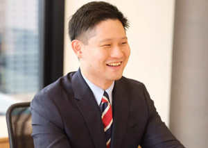

# JAWS-UG Sales支部とは？
  

JAWS-UG Sales支部は、AWSクラウドに関わる**営業職やマーケター向け**の勉強会コミュニティです。  
2018年9月に大阪で発足し、「**エンジニアじゃなくても楽しめるJAWS-UG**があってもいいんじゃないの？」という、ノリと発想から生まれました。  

クラウド業界では年々AWSを扱うソリューション営業が増え、営業職も最新情報のキャッチアップが欠かせません。  
しかし通常のエンジニア向け勉強会はハードルが高く感じる営業職も多いでしょう。  
そこで**営業やビジネス職が気軽に集まり、仕事を楽しむための知見共有や交流ができる場**として、Sales支部が誕生したのです 。  

AWSの技術ネタだけでなく、日々の営業活動のTipや困りごとを持ち寄ってみんなで解決策を探る、アットホームな雰囲気のコミュニティです。  
  
---

## 初心者でも楽しく参加できるポイント
**JAWS-UG Sales支部最大の特徴は「非エンジニアでも楽しめる」こと**です。  
対象はクラウドに関わる営業・マーケ・カスタマーサクセス・プリセールス・サポートなど幅広く、技術スキルよりもビジネス視点を重視した内容になっています。  

- **わかりやすいテーマ**  
  「営業目線でAWS Summitをどう感じたか」「顧客とのやりとりで役立つクラウド知識」など、実務に直結する話題が多く初心者も理解しやすい。  

- **Fresh枠（新人LT枠）の存在**  
  「LT初挑戦の方、大歓迎！」という新人向けの登壇枠があり、安心して発表できる。  

- **温かい応援ムード**  
  発表後は大きな拍手とコメントが飛び交い、初心者もチャレンジしやすい雰囲気。  

さらに「**学んだことが即仕事に活きる**」のもSales支部ならではです。  
AWS資格取得を通じて営業成績を伸ばした事例など、身近な成功体験が共有されています。  

---

## イベント内容と支部の雰囲気
Sales支部のイベントは**参加型・多彩**なのが特徴です。  

- **LT大会**  
  営業・マーケ目線のネタで発表。「推しAWSサービス」や「お客様とのAWSあるある」など。  

- **提案コンペ―仮想RFPコンテスト―**  
  提示されたお題に即興でチーム提案を披露。後日「振り返り会」で議論を深める徹底ぶり。  

- **生成AIアイデアソン（予定）**  
  AWS目黒オフィスでのオフライン開催。参加者同士でチームを組み、ぶっちゃけトークからアイデアを膨らませる。  

---

## おわりに – 初心者こそSales支部へ！
JAWS-UG Sales支部は、**初心者に優しく開かれたコミュニティ**です。  
非エンジニアが主役になれる数少ない支部であり、明るくアットホームな雰囲気が魅力。  
  
LT大会での小さな成功体験や、懇親会での出会いが、あなたのAWS活用を後押しします。  
「営業がクラウドを学んで何が楽しいの？」と思う方こそ、一度参加してみてください。  

**いつでも新しい仲間を歓迎しています。**  
「営業が楽しむJAWS-UG」の一員として、一緒にAWSコミュニティを満喫してみませんか？  

Connpassのページ：[https://jawsug-sales.connpass.com/](url)  

___

#### Sales支部運営メンバー
**ニシ サダオミ**  
  
X：[https://x.com/sadabon444](url)  
営業なのに、コミュニティとAWSを愛する変わり者。  
2024年のJAWS DAYS参加をキッカケに、AWSにドップリとハマる。    
無類の旅行好きで、JAWS-UG地方支部に行くことが最近の趣味。  

**岡田 行司（オカダマン）**  
  
Facebook：[https://www.facebook.com/koji.okada2](url)  
2024年のre:InventでJAWS-UG Salesのリブートを決意。  
お仕事ではカスタマーサクセス（CS）組織を2022年に立ち上げた。  
好きな業務はクレーム対応。  
