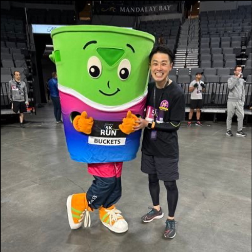

# JAWS-UG横浜支部で人生初のLT登壇を経験して

深津　新太郎（@shin_fukatsu） 

今ではいろいろな支部のイベントに参加して、登壇もさせていただいている私ですが、そのきっかけをいただいたJAWS-UG横浜支部に御礼の意味も込めて紹介レポートを書かせていただきます。 
JAWS-UG横浜支部 https://jawsug-yokohama.connpass.com/

## 初めての登壇までの道のり

オフラインイベントに参加しても、一人で参加していて誰かとなかなか話せない、参加していて一人だとどうしようと不安になることがありますよね。私もコミュニケーションを上手に取れる人間ではないので、いつも不安に感じていました。

一方でコミュニティという場で会社の垣根を超えて人と人が繋がっているのを見て、とてもいいな、自分も入りたいなと感じていました。でも自分から話しかけるのもきっかけをどうしようか、自分から話しかけにいくのが難しければ、きっかけを作って話しかけてきてもらうのが良いのではないか。きっかけは・・・よし、試しにLT登壇してみよう！と思いついたところから始まりました。

当時、re:Inventという年に一度ラスベガスで開催される大規模なAWSカンファレンスに参加する予定だったので、帰国後に現地で学んだことを話せば、イベントに参加している方々に気に止めてもらえるのでは？と思い、私は人生初のLT登壇の申し込み先を探しました。
スケジュール等を考えて、最終的に選んだ場所が、JAWS-UG横浜支部で開催された「AWS re:Invent 2024 宇宙一早い re:Cap」というイベントです。

帰国翌日の夜に開催されるということで、名前の通り「宇宙一早いre:Cap」です。移動中の飛行機の中で必死に登壇資料を作成していたことを今でも鮮明に覚えています。時差ボケと疲労の中での資料作成は大変でしたが、re:Inventで得た新鮮な情報を早く共有したら、どういった反応が返ってくるだろうかというワクワクした気持ちが私を突き動かしていました。

5分というとても短い時間でしたが、私にとってはとても価値のある重要な5分間でした。登壇後、懇親会で色々な方からお声がけをいただきました。共感を得た部分についてお話をいただいたり、実際どうでしたか？といった現地での反応について質問をしてくださる方もいて、登壇して良かったと改めて感じました。

## 10年の歴史を持つコミュニティの温かさ

JAWS-UG横浜支部は10年以上の長い歴史を持つコミュニティです。そんな歴史あるコミュニティが、新参者である私のLTを温かく受け入れてくれたことに感謝しかありません。ちなみに、私は横浜とは全く縁がありません。仕事も地元も、住んだこともない土地です。それでも個人参加で飛び込んだ私を迎えてくれました。会社の同僚がいるわけでもない、完全にぼっち参加でしたが、全く孤独感を感じることはありませんでした。

## 素晴らしい開催環境

当日の会場はヤマハ発動機さんのYAMAHA MOTOR Regenerative Lab（リジェラボ）という共創スペースをお借りしており、とても綺麗でおしゃれな空間でした。こういった他社のイベントスペースを訪問できるのも、コミュニティ活動ならではの魅力だと感じました。普段は入ることのできない企業の施設を見学できるのは、技術者として非常に刺激的な体験にもなりました。

## 継続的な学びの場

JAWS-UG横浜支部では、LTイベントだけでなく、積極的にハンズオン会も開催されています。実際に手を動かして学べる機会が豊富に用意されているのは、技術力向上を目指す参加者にとって非常に価値のあることです。私自身、初回のLT登壇後も何度か参加させていただいています。一度参加すると、その居心地の良さと学びの多さに魅力を感じ、自然と足が向くようになりました。

また、この経験を通してコミュニティ運営に携わりたいなと思い、居住地である埼玉県でJAWS-UG彩の国埼玉の立ち上げの際に参画させていただくことになりました。

## 初心者の方へのメッセージ

これからJAWS-UGに参加を検討している初心者の方には、まずは顔を出してオフラインで参加し、雰囲気を感じてみることをお勧めします。無理に登壇からスタートする必要は全くありません。また、ぼっち参加になることを心配する必要もありません。他にもきっと一人で参加している人はいますし、コミュニティの皆さんが温かく迎えてくれます。私自身がその証拠です。

技術コミュニティは、学びたい気持ちさえあれば誰でも歓迎してくれる場所です。JAWS-UG横浜支部での経験は、私のエンジニア人生において大きな転換点となりました。皆さんもぜひ、勇気を出して一歩踏み出してみてください。

#### 著者紹介

---

    
    

        

            <b>深津　新太郎</b>  
            X：<a href="https://x.com/shin_fukatsu">@shin_fukatsu</a>  
            Qiita：<a href="https://qiita.com/sh_fk2">@sh_fk2</a>  
        

        

            JAWS-UG 彩の国埼玉支部運営
        

    

AWS Community Builders 2025 (Cloud Operations) 
　AWS Certifications x 15 
　現在はオンプレシステム更改のPMを担当 
　re:Invent 2022-2025参戦 

