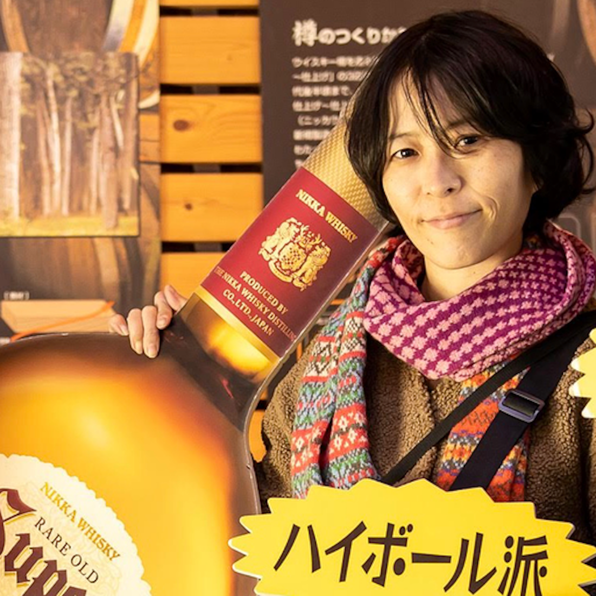

# JAWS-UG 情シス支部とは？

山﨑奈緒美(nao_spon)

JAWS-UG 情シス支部は、AWSを自社内で利用している企業において統制・推進、内製開発を行う社内エンジニアのための勉強会コミュニティです。  
JAWS-UG 情シス支部のページ：https://jawsug-sysad.connpass.com/

## JAWS-UG 情シス支部が生まれたきっかけ
私自身が"情シス"としてAWSを利用していくにあたり、どのように導入を進めていくのか、予算や稟議、按分等の費用関係、AWS利用ポリシーの策定や監査対応などの内部統制、セキュリティガバナンス、運用管理、開発ベンダーへ依頼している場合はどのように進めていくのか・・・さまざまな悩みを抱えていました。  

またこれらの悩みについて、自社のやり方で合っているのか、もっと良いやり方があるのではないか？   
AWSのベストプラクティスはAWSのソリューションアーキテクトの方へ相談したらわかるものの、では実際の現場ではどうなんだろう？他社企業ではどのようにしているのだろう？という疑問もありました。 

通常、普通に仕事をしていただけでは他の企業の同じような立場の方とお話をする機会は無いに等しい状況です。  
それなら、みんなで議論する場を自分で作ろう！ということで2015年11月にJAWS-UG 情シス支部として発足しました。  

## こんな人におすすめ
- AWSを利用したサービスやシステムを利用するにあたり、社内でどのように利用するのか、利用促進・拡大をするには？といった社内SEとしての観点で議論したい人
- 自社内でAWSを実際に利用してみてわかったことなどの知見を共有したい人
- 自社システムやグループ内のシステム担当であれば所属企業の種別は問いません。
  - SIer、CIer、メーカー、システム子会社、ユーザ企業のいずれに所属されていても、ひとり情シスでも兼務情シスの方でも現場部門の方でも参加可能です。

**ユーザー企業の情シス部門所属でないとダメと思われることもあるのですが、内製で自社サービスをAWS上で開発・構築・運用しているような方もOKです。**  

ですが「お客様企業のシステムを作っている」方においては、社内統制や自社内での利用促進といった観点が異なるため、"Not for me" な内容かもしれません。
  

## Before 2020, and after
2015年〜2019年の間は目黒のAWSジャパンさんの会議室をお借りして、20名程度の人数で全員でその時のテーマについてフリーディスカッションをする方式をしていました。  
例えば・・・
- 大規模障害をテーマにその時どうする・ユーザ企業の情報システム部門はどうした・どうすべきか
- AWSのIaC活用
- 自社内でのDaaS活用
- 社内でのAWS技術者の育成
- AWS上でのログ監査基盤やセキュリティ
- 予算と稟議

特定の技術要素がテーマの際には前半はAWSのSAさんによる説明や参加者の方による事例紹介などをし、そこからみんなでディスカッションをしていました。  
ちなみに一番盛り上がったのは「予算と稟議について」です。  
時間内では物足りない参加者が多数出て、懇親会でも盛り上がりました。  

そして2020年はコロナ禍により、オンラインでの開催をしていたのですがオンラインでのディスカッションではファシリテーションの難しさを感じ、あまり開催をできていませんでした。  
また、私自身が東京から札幌へ移住したこともあり、以前のように気軽にAWSさんのお部屋を借りて・・・ということも難しくなってしまいました。  

2025年は情シス支部が10周年を迎えるということもあり、また、自分自身が首都圏から地方都市へ移住し、地方企業でのAWS利用を自分自身も経験し、周りの方達から見聞きしたところから、こんな想いが出てきました。  
- **地方企業の情シスの方々もAWSを利用しているけれど、なかなか情報交換できる場が無いのでは？**  
- **首都圏ではAWSの利用は割と一般的になってきているものの、地方ではまだまだ悩んでいる情シスの方は多いのでは？**  
- **地方では首都圏の勉強会に参加するにも移動コストがかかり、気軽に参加しづらいのでは？**

首都圏では毎日のようにAWS関連の勉強会が開催されていますが、地方ではそもそも開催頻度が少なく、同じ立場の方と出会う機会も限られています。だからこそ、地方でこそ情シス支部のような横のつながりを作る場が必要だと感じています。

## それなら、地方で情シス支部をしよう！
ということで、2025年5月に札幌、同年9月に神戸で、それぞれ地元の支部とコラボレーションという形で勉強会を開催しました。  
また、日程は未定ですが熊本や北九州でも開催を予定しています。  

内容については前半は事例の紹介LT、後半はテーマをもとにしたチョークトークの形式をとっています。  
チョークトークとは、いわゆるゼミの授業のような形式で、架空の企業の架空のシステムを対象にディスカッションテーマを決め、参加者のみなさんには手をあげて発言していただく形となります。  

たとえば、過去の開催では以下のようなテーマで実施しました。
- テーマ：ECサイト運営をしている企業のシステムにおけるCloudWatchの利活用について
  - セール時の負荷対策として、どのような自動化を実装するか？
  - バッチ処理の異常検知で工夫している点
  - セキュリティインシデントの検知・対応で効果的だった施策
- テーマ：物流業企業におけるEoL対応について
  - 予算確保のためにEoL対応を「コスト」から「投資」へ視点転換する経営層への説明
  - EoL対応を実行する上でのシステム移行についてどのように移行計画を立てるか
  - 組織内のスキルアップ推進のためどのような施策をするか

皆様のお住まいの近くである時はぜひ来てくださいね！

## おわりに
JAWS-UG 情シス支部では自社内でAWSを利用している情シス部門や内製開発部門、現場部門ならではの悩みの解決や知見の共有を目指して活動しています。  
同じような立場だからこそ聞きたい、知りたいことがあるのではないかと思います。  

初めての参加でも大丈夫です。チョークトークでは発言を強制することはありませんし、まずは聞くだけの参加でも全く問題ありません。「こんなこと聞いていいのかな？」と思うような素朴な疑問こそ、実は多くの方が抱えている共通の悩みだったりします。  
ぜひ一度、お気軽に参加してみてください！

___

#### 情シス支部運営メンバー

---

    
    

        

            <b>山﨑奈緒美(nao_spon)</b>  
            X: <a href="https://x.com/nao_spon">https://x.com/nao_spon</a>  
            AWS Samurai 2015: <a href="https://jaws-ug.jp/samurai/">blogs</a>  
            所属支部: <a href="https://jawsug-sysad.connpass.com/">JAWS-UG 情シス支部</a> / <a href="https://jawsug-arch.connpass.com/">JAWS-UG アーキテクチャ専門支部</a>  
            ソフトハウスでインフラエンジニア→地図情報システム開発会社でひとり情シス→旅行会社の情シス部門でクラウド担当→  
            2020年9月に東京から札幌へ移住し、10月よりコープさっぽろへJOIN  
            AWSのことならなんでも担当  
        

    

 
 

    
    

        

            <b>砂岡雪(白"雪姫”)</b>  
            X: <a href="https://x.com/yuri_snowwhite">https://x.com/yuri_snowwhite</a>  
            所属支部: <a href="https://jawsug-sysad.connpass.com/">JAWS-UG 情シス支部</a> / <a href="https://jawsug-cloudgirl.connpass.com/">JAWS-UG クラウド女子会</a>  
            小企業派遣社員でネットワークエンジニア→ソーシャルゲーム会社でインフラエンジニア→ベンチャー企業で情シス部門・インフラエンジニアを経て、同社のセキュリティエンジニア→現在は外資系企業のSREをメインにセキュリティエンジニアを兼任。  
            2025年からCommunity Builders  
        

    

