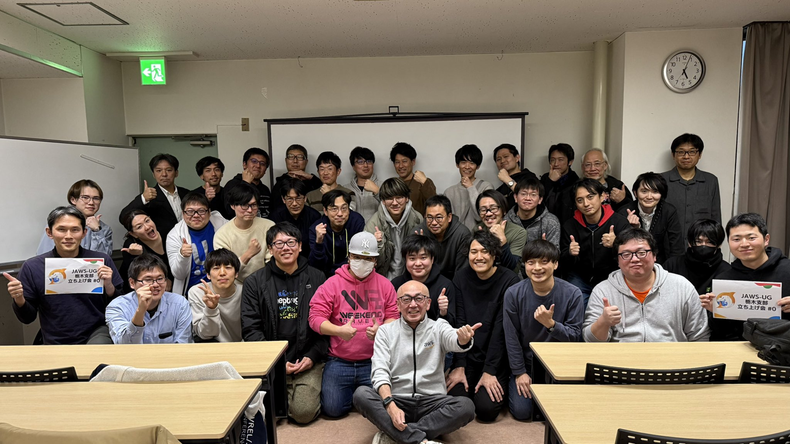
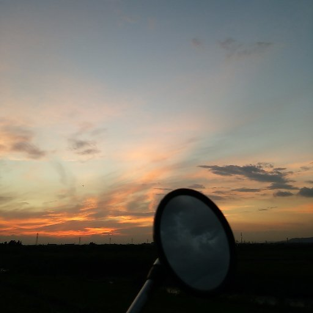

# JAWS-UG栃木支部にお越しください

JAWS-UG運営のジャニ([Journeyman](https://x.com/beajourneyman))です。2025年に「JAWS-UG栃木支部」を立ち上げ1年弱活動したので、これまでのJAWS-UGとのかかわり、栃木支部立ち上げの経緯、栃木支部の紹介、1年間の活動のふりかえりをします。

https://jawsug-tochigi.connpass.com/

## これまでのJAWS-UGとのかかわり

JAWS-UGを知ったのは、活発なユーザーグループをマーケティング観点で調べていたところから始まります。初参加は三沢の立花さんが実行委員長をされた「[JAWS DAYS 2017](https://jawsdays2017.jaws-ug.jp/)」でした。当時から全国50支部以上がある巨大なユーザーグループで、企業の有償カンファレンスに劣らないクオリティと、他では体験したコトがない圧倒的な熱量で強く心に刻まれました。

当時はSIerで新しいソリューションを広めるためのオウンドメディアの編集長兼メインライターとSNSの運用をやっていました(事情によりメディアは残っていません)。2年担当した後、データセンター運用と業務改善を担当していました。

運用の仕事はとても大事ですが、何か新しいチャレンジをしたいと思うようになり、一念発起してCLFを取得しました。オンライン勉強会で、今はすっかり「AWS Jr.Champions」の顔になった高橋ゆっきーさんが解説されていた入門のスライドが大きな後押しになりました。マーケティング始点で知ったAWSの認定を取る日が来るとは…。

https://yoshidashingo.com/entry/2022/12/04/213746

吉田真吾さんのブログをきっかけに自らのダメさを身をもって知りたくなり、AWS Summit 2023 で GameDay に参加しました。技術そのものに対する解像度が一気に上がる目の覚める体験でした。

大した技術力もないので、思いだけで GameDay をテーマに「[JAWS Festa 2023 in KYUSHU](https://jft2023.jaws-ug.jp/)」で初登壇しました。その翌年の「[JAWS DAYS 2024](https://jawsdays2024.jaws-ug.jp/)」では、どうしても採択されたく、4本のCfPを出して、何とか登壇できました。

2023年度が"真にJAWS-UGに参加する"初年度だった、とふりかえって思いました。

## JAWS-UG栃木支部立ち上げの経緯

FestaやDaysの登壇は果たせましたが、コミュニティから受け取った数えきれないギフトを返すには、十分ではないとずっと感じていました。支部設立を意識してから実際に立ち上げるまでに実は3年かかっています。

関東は長らく茨城と栃木に支部がありませんでした。そこには大きな壁がありました。ITコミュニティの過疎地域だったのです。立ち上げ目前の時に東京の勉強会と栃木の勉強会の開催予定を調べたら、**なんと100倍の規模の違い**があったのです。そこから分かるコトは、「地域 x AWS」のつながりを作るのは至難の業だという現実です。

**なければ自分で作る。地元栃木に、地元小山に。**

決意はしたものの、3年かかった一番の理由が、運営メンバーの探しでした。出会いはなかば奇跡でした。AWSを学ぶ所属のコミュニティがあり、たまたま AWS Jam のバディだったのが今のJAWS-UG栃木支部を共同で立ち上げてくれた森尾さんでした。灯台下暗しとはこのコトです。ただ、日本中のJAWS-UGでつながりを作ったり、所属内の他部門との交流につながる越境を繰り返していた結果が結実したととらえています。

やっとスタートラインに立てた瞬間でした。

※こちらのストーリーは、[DevRelKaigi 2025](https://devrelkaigi.org/ja) で採択いただき30分セッションで詳しくお話ししたので、ご興味がある方はご覧ください。

https://www.docswell.com/s/8916250/KN92GE-20251004_DevRelKKaigi2025_jawsug_tochigi_beajouneyman

## JAW-UG栃木支部の特徴

＜ 支部活動方針 ＞
- コミュニティ過疎県栃木の現状を変える
- 登壇・貢献を全力で後押しする
- つながりを作るハブになる

「コミュニティ過疎県の現状を変える」については、活動実績を後述しますので、どうなったかご確認ください。

「登壇・貢献を全力で後押しする」。コレは2つの特徴的な運営スタイルに関連しています。1つ目は、可能なら全員自己紹介をしています。何もか知ってもらうのは案外難しいです。自分自身登壇するまでハードルがありました。2つ目は「参加型トークセッション」です。コレは当方とバディの方が前に立って、みなさんに意見を求めながらお題について議論する場です。恒例になっており、普段登壇されない方に、ご自身の考えやアイデアを気軽に話していただく機会になっています。今まで数十名の方にお話ししていただいています。

つながりを作るハブなるの施策として、小山開催にしています。首都圏、いや関東甲信越から比較的アクセスしやすい小山市で開催しています。栃木県の県庁所在地は宇都宮ですが、明示的に小山の開催を軸にしています。理由はいくつかありますが、同じ北関東の群馬、茨城から両毛線、水戸線でアクセスしやすい点は大きいです。また、宇都宮は都心部から100km越えですが、小山は80kmと在来線でもアクセス可能な近さ(約80分)があります。

なお、オリジナルロゴは検討中です。もう少々お待ちください。

## 2025年の活動実績

- オフライン 6回 うち満員御礼4回
- オンライン 13回(1回は12月開催予定) うち満員御礼3回
- connpassメンバー 0→152名 ※2025/12/04現在
- ストックされた資料 70本

 

立ち上げ回の集合写真です。初年度から奇数月にオフライン、毎月オンラインもくもく会を開催すると決めて、しっかり走り切れました。ただ、大きな課題として、運営メンバーが3名しかいないので、台所は非常に厳しいです。栃木にゆかりがあるお知り合いを紹介いただけると、とても嬉しいです。

来年2026/02/07(土)には、通常の約3倍の規模で1周年記念回を開催予定なので、予定確保をお願いします！！

以上、最後までご覧いただきありがとうございます。引き続き栃木支部をよろしくお願いします！！！！

#### 著者紹介

---

    
    

        

            <b>Journeyman(ジャニ) </b>
            <a href="https://x.com/beajourneyman">X@beajourneyman</a>
        

        

            コミュニティ：JAWS-UG栃木支部
        

    

日本全国のJAWS-UGに登壇・参加。地域支部とつながり、運営を学び、JAWS-UG栃木支部を立ち上げた。発起人。 
Amazon Connect を基盤としたシステムの開発維持のPM。仕事柄、ニッチな音声系のサービスを追っている。桃と餃子と登山が好き。

