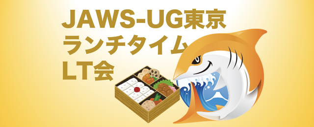
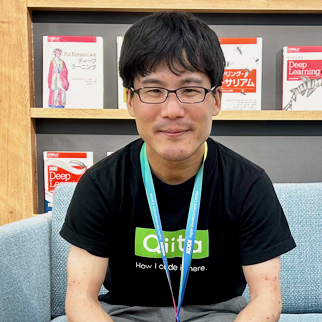
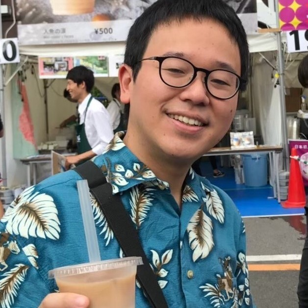
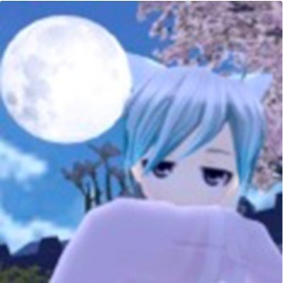
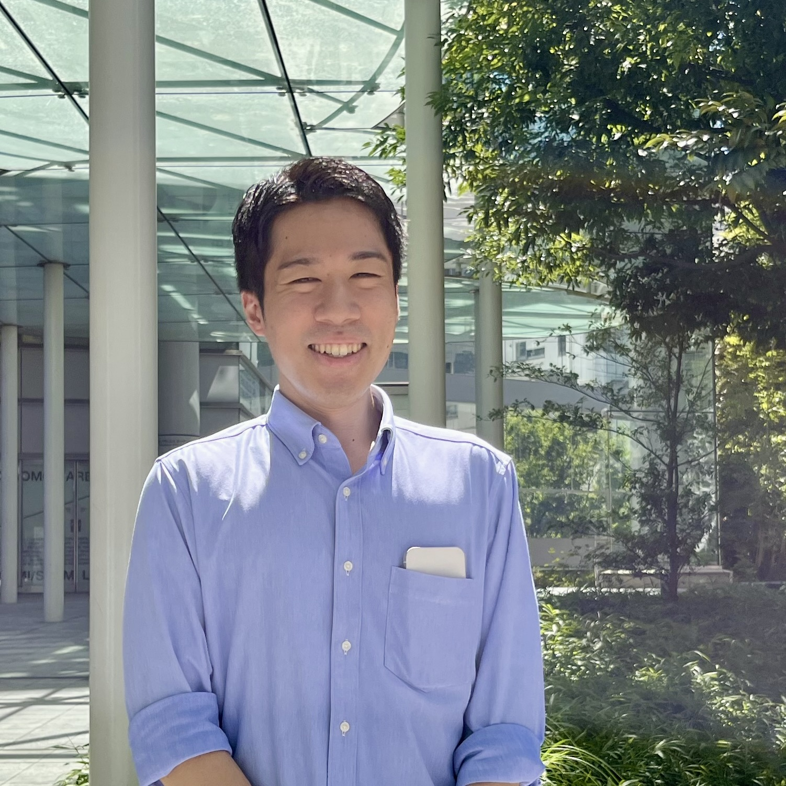

# 東京支部のススメ

大木 裕介 (y-ohgi)

JAWS-UG東京支部の紹介をさせていただきます。  
https://jawsug.connpass.com

## 東京支部リブート
支部の発端はみのるんさんが2年前に東京支部のリブートツイートを行い、そこのリプライに集まった3人とみのるんさんからリブートが始まりました。  
ちなみに今も入れ替わりなく支部のメンバーは4人です。

## ランチタイムLT会

毎月やっているランチタイムLT会は最初の半年でそれぞれが「司会係」「配信係」「X(旧Twitterを監視して質疑応答を拾う)係」のおおまかに3つのロールを作ってそれぞれ順番に回しました。  
そのおかげで半年後には実質バス係数4になり、1人でもランチタイムLT会ができる体制が整いました。  
配信当日までの登壇者へのアポイントやアンケート作成・次回のconnpass作成などはベストエフォートで「できる人がやる」形で回しています。

## 特産品
東京支部の特産品としては「運営がスタンドアローンで思いついた勉強会を生やしてやりたいことをやる」というものがあります。  

みのるんさんによるBedrock Night、watanyさんによるPresents 400、私（y-ohgi）によるCommunity Builders Nightなど、各自がスタンドアローンで勉強会を主催しています。  
これは各位の経歴的にクラウドを推進するポジションに居たことがひとつの理由なのかなと思っています。  
また、それぞれのイベントをサポートし合うところもこの支部の良いところだと思っております。

## 余談: 4人集まらない呪い
東京支部は2年運営を行い、毎月ランチタイムLT会を行っているのですが運営4人が集まったことがオンラインオフラインともに極めて少ないです。  
4人なのに片手で数えられる回数しか集まったことがない謎の呪いがかかっています...  
なのでメンバーを増やすような意思決定の機会がなく

## さいごに
東京支部が行っているランチタイムLT会は毎月完全オンラインで全国から登壇者を募集しています。  
完全抽選性で1枠5分なのでカジュアルにアウトプットの最初の一歩目として是非登壇していただきたいと運営一同思っています。

#### 東京支部運営メンバー

---

    
    

        

            <b>みのるん @minorun365 （KDDIアジャイル開発センター株式会社）</b> 
        

    

クラウドや生成AIで内製開発を行いながら、技術の楽しさを伝える活動をしています。 
AWS Community Hero, AWS Samurai, 2025 Japan AWS Top Engineer & All Certs, Qiita 2024 Top Contributor / 著書「Amazon Bedrock 生成AIアプリ開発入門」（SBクリエイティブ）,「やさしいMCP入門」（秀和システム）

    
    

        

            <b>watany @_watany (NTTテクノクロス株式会社)</b> 
        

    

2015年からAWSを用いた開発に携わり、アーキテクト・運用設計支援として活動する一方で、社内にてテクニカルサポートや研修講師を務めています。 
また、AWS Community BuilderとしてAWS CDKのContributeや技術ブログの執筆を行っています。2024 AWS Ambassadorを受賞。

    
    

        

            <b>y-ohgi @_y_ohgi (株式会社Topotal)</b> 
        

    

株式会社TopotalでSREをやっております。 
新卒として合同会社DMM.comに入社しCTO室でクラウドの活用方針・普及・技術支援など全般を携わらせて頂きました。その後、フリーランスとしてクラウドのスポットでの開発・技術支援・技術顧問などのお手伝いをやらせていただいています。2025 AWS Community Builder (Container)

    
    

        

            <b>ムリギッテ @momitanJP</b> 
        

    

パブリックセクターから金融機関、製造業まで様々な業界のお客様に向けたシステム提案・導入をしています。 
最近はCDK、コンテナ、データ基盤がメイン。趣味はBlackbeltを聞きながら筋トレです。

